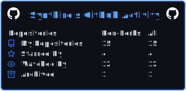
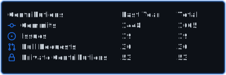
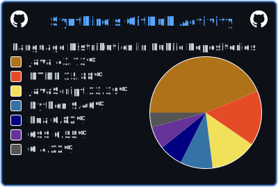

## <> Hi there! I'm Synthird! </>

- 🕛 I have been programming since mid 2020
  - 🕹️ I got into programming when I started learning to make video games
    - 🎮 You can play the ones I published on [itch](https://synthird.itch.io)
  - 📘 The first language I learned was [Lua](https://lua.org/)
- 🎨 I also create [art](https://cara.app/synthird)
- I never use "AI" that spit out or edit text, code, images, videos, audio, graphs, etc.
- ⚡ Fun fact: You are reading this in the present!

  
:octocat: GitHub profile statistics
  

   

   

   

<!--
**Synthird/Synthird** is a ✨ _special_ ✨ repository because its `README.md` (this file) appears on your GitHub profile.

Here are some ideas to get you started:

- 🔭 I’m currently working on ...
- 🌱 I’m currently learning ...
- 👯 I’m looking to collaborate on ...
- 🤔 I’m looking for help with ...
- 💬 Ask me about ...
- 📫 How to reach me: ...
- 😄 Pronouns: ...
- ⚡ Fun fact: ...
-->
